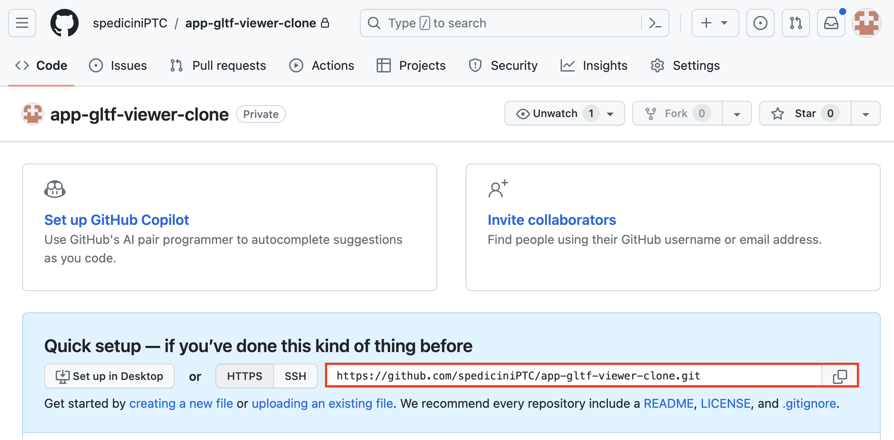

## **README**
The GLTF Viewer is a sample application that demonstrates:
 * How to fetch a glTF representation of an Onshape model. 
 * How to create an app that runs as a tab inside an Onshape document
 * OAuth2 authentication
 * Use of REST APIs
 * Use of document context

The application is built using Express and is deployed on Heroku.

## Prerequisites

1. Install the necessary software:  
    * Git
    * npm
    * Heroku CLI (or the deployment server of your choosing)
      * MacOS: `brew tap heroku/brew && brew install heroku` 
      * Linux distributions that support Snap applications: `sudo snap install --classic heroku`
      * Windows: (download the Heroku CLI Installer)[https://devcenter.heroku.com/articles/heroku-cli#install-the-heroku-cli]
    * Docker 
      * Tip: You do NOT need to log in to Docker, just have it installed.
      * If you see the "you are not allowed to use Docker" error on Windows, (follow the troubleshooting steps here)[https://icij.gitbook.io/datashare/usage/faq/common-errors/you-are-not-allowed-to-use-docker-you-must-be-in-the-docker-users-group-.-what-should-i-do].
2. Make sure you have a set up a [Github](github.com) account.


## Clone the repository
1. Make a bare clone of the sample app’s repository: 

    ```
    git clone --bare https://github.com/onshape-public/app-gltf-viewer.git
    ``` 
2. Navigate to your Github account and create a new, blank repository named `app-gltf-viewer-clone`
3. Copy the HTTPS URL of the repository you just created. You can find this on the **Code** tab in your repo.



4. Navigate into the cloned repo and push it to your new repository:
    ```
    cd <path-to-cloned-repo>/app-gltf-viewer.git 
    git push --mirror <copied-HTTPS-URL>
    ```
    e.g.:
    ```
    cd ~/Documents/onshape-public/app-gltf-viewer.git
    git push --mirror https://github.com/<your-github-username>/app-gltf-viewer-clone.git
    ```
5. If prompted, enter your Github username and [personal access token](https://stackoverflow.com/questions/68775869/message-support-for-password-authentication-was-removed-please-use-a-personal) into your command line.
6. Delete the initial repository that you cloned:
    ```
    cd .. && rm -rf app-gltf-viewer.git
    ```
7. Clone your newly mirrored repository:
    ```
    git clone https://github.com/<your-github-username>/app-gltf-viewer-clone.git
    ```

## Create a Heroku app
If using a different deployment platform, please refer to the platform's documentation for creating a new app.

1. Log in to your Heroku dashboard.
2. Click **New > Create new app**
3. Name your app `app-gltf-viewer-yourname`.
4. Click **Create app**.
5. Click **Open app** in the top-right corner of the Heroku dashboard.
6. Copy the URL of the page that opens. This is your Heroku app URL.


## Create an Onshape OAuth app

1. Navigate to https://dev-portal.onshape.com/signin and log in.
2. In the left sidebar, click **OAuth applications**.
3. Click the **Create new OAuth application** button.
4. Fill out the form as follows:
    * Name: `gltf-viewer-yourname`
    * Primary format: `com.yourname.gltf-viewer`
    * Summary: `Onshape GLTF viewer sample app`
    * Redirect URLs: `<Heroku-app-URL>/oauthRedirect`
        * e.g., `https://app-gltf-viewer-yourname-c11f263794bc.herokuapp.com/oauthRedirect`
    * Admin team: `No Team`
    * OAuth URL: `<Heroku-app-URL>/oauthSignin`
        * e.g., `https://app-gltf-viewer-yourname-c11f263794bc.herokuapp.com/oauthSignin`
    * Permissions:
        * Application can read your profile information
        * Application can read your documents
        * Application can write to your documents
5. Click **Create application**.
6. **COPY THE SECRET KEY FROM THE POP-UP WINDOW**. You will not be able to access this secret again. It is unique to your and your app and should be protected like any sensitive password.
7. Copy the **OAuth client identifier** from the app Details page that opens. You will need this in addition to the client secret you copied in the previous step.

## Create an Onshape App Store entry
1. Click the blue **Create store entry** button at the bottom of the app Details page.
    * If you navigated away from the app Details app, navigate to https://dev-portal.onshape.com/signin and log in, click **OAuth applications** in the left sidebar, then click the **gltf-viewer-yourname** entry.
2. Click the **Category** dropdown and select `Utilities`.
3. Add a description to the **Description** field.
4. Type `Onshape` in the **Vendor** field.
6. Click **Create**. The `gltf-viewer-yourname` app appears on your **Store entries** page.

## Create an Onshape extension
1. In the developer portal, click **OAuth applications** in the sidebar, then click `gltf-viewer-yourname`.
2. Click the **Extensions** tab.
3. Click the **Add extension** button.
4. Fill out the Create extension dialog:
    * Name: `gltf-viewer`
    * Location: `Element tab`
    * Action URL: `<Heroku-app-URL>`
        * e.g., `https://app-gltf-viewer-yourname-c11f263794bc.herokuapp.com`
5. Click **OK**.

## Configure Heroku
1. Make sure Docker is open and running on your machine. You do not need to log in.
2. In your command line, run `heroku login` and follow the onscreen prompts to log in to your Heroku account. 
3. Next, run:
    ```
    cd <path-to-cloned-repo>
    heroku git:remote -a app-gltf-viewer-yourname
    ```
    (Note that you only need to do this step once. You can skip it the next time you log in.)
4. Finally, run:
    ```
    heroku container:login
    ```
5. Run the following in the command line:
    * `heroku config:set API_URL=https://cad.onshape.com/api`
    * `heroku config:set OAUTH_CALLBACK_URL=<heroku-app-URL>/oauthRedirect`
        * Replace the bracketed text with your Heroku app URL from **Create a Heroku app, Step 6**.
    * `heroku config:set OAUTH_CLIENT_ID=<client-id-from-created-app-in-dev-portal>`
        * Replace the bracketed text with your OAuth client ID from the dev portal from **Create an Onshape OAuth app, Step 7**.
    * `heroku config:set OAUTH_CLIENT_SECRET=<client-secret-from-created-app-in-dev-portal>`
        * Replace the bracketed text with your OAuth client secret from the dev portal from **Create an Onshape OAuth app, Step 6**.
    * `heroku config:set OAUTH_URL=https://oauth.onshape.com`
    * `heroku config:set WEBHOOK_CALLBACK_ROOT_URL=<heroku-app-URL>/`
        * Replace the bracketed text with your Heroku app URL from **Create a Heroku app, Step 6**.
    * `heroku config:set SESSION_SECRET=<a-cryptographically-secure-string>`
        * Replace the bracketed text with a secure password string.
    
    e.g.:
    ```bash
    heroku config:set API_URL=https://cad.onshape.com/api
    heroku config:set OAUTH_CALLBACK_URL=https://app-gltf-viewer-yourname-c11f263794bc.herokuapp.com/oauthRedirect
    heroku config:set OAUTH_CLIENT_ID=VERYLONGSTRING=
    heroku config:set OAUTH_CLIENT_SECRET=SECRETVERYLONGSTRING===
    heroku config:set OAUTH_URL=https://oauth.onshape.com
    heroku config:set WEBHOOK_CALLBACK_ROOT_URL=https://app-gltf-viewer-yourname-c11f263794bc.herokuapp.com
    heroku config:set SESSION_SECRET=pink.ants.wear.purple.booties.at.midnight.37!
    ```
6. Run `heroku config` and confirm your settings are correct.

## Build and subscribe to the app
1. Commit your changes by running `git commit -am "First commit"`
2. Run the following in your command line: `git push heroku`
3. Navigate to https://appstore.onshape.com/
4. Search for `gltf-viewer-<yourname>` and select it from the search results.
5. Click the **Subscribe** button.
6. Click **Get for free**.
7. Click **Close**.

## Use the GLTF viewer extension in Onshape
1. Create a new Onshape document or open an existing one.
2. With at least one Part in the document, click the **+** button in the bottom-left corner of the Onshape screen, then click **Applications > gltf-viewer**.
    
3. When prompted, click **Authorize application**.
4. Click the **Select an item** dropdown and choose an Element. Give the gltf viewer a few moments to load.

Note that if you have a complex model with a lot of parts, translating the model to GLTF can be time consuming. If you think there is an issue loading or rendering your model, you can open the Javascript console of your browser to check for any errors.

Once the model is rendered, the following controls are available to you:
* Zoom:	Mouse wheel
* Rotate: Left-click and move mouse
* Pan: Right-click and move mouse

That's it! Now you can use the gltf viewer in your Onshape documents, and you can refer to your `app-gltf-viewer-clone` repository in Github to see how the app handles authentication.

